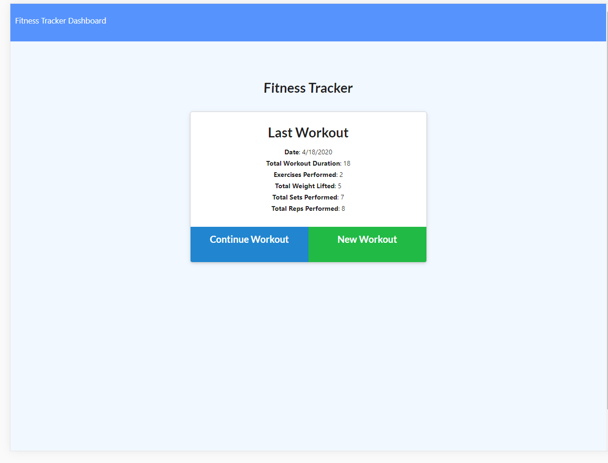

# workout-tracker
Tool to allow user to be able to log multiple different type of exercises in a workout on a given day.

## Description

Created a fitness tracking app utilizing Node.js, Express.js, MongoDB, Heroku and Mongoose. Majority of the front end code was provided in a homework prompt as part of a web development boot camp. Allows the user to track their workouts and save them in a database.

## Live site:

https://fast-ocean-78790.herokuapp.com/

## Demo:

 
## Installation
You will need to npm init to get all the required node modules. If you are running the code locally the local host is set to port 3000. You will also need to go in to the config folder and possibly change the config.json values. The file I used to start the project is server.js.

## Usage

The primary purpose of this was to meet the requirements of a homework assignment. The major goal seems to be practice with MongoDB and Mongoose You could use it to track a workout, or as the basis of a workout app.
